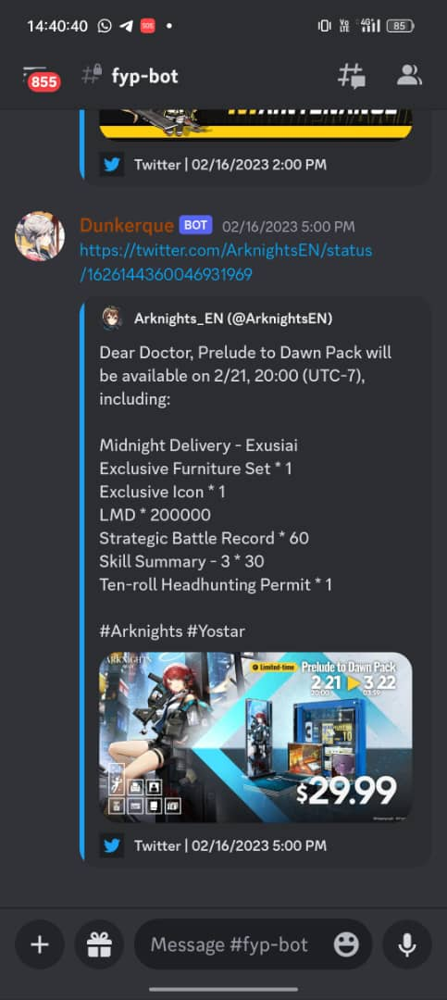

# Twitter Feed Discord Bot written in Python
This is a Discord Bot that notifies a specific Discord channel when the user has made a new tweet, written using Discord.py, Tweepy and PostgreSQL asyncpg.

 

Description
======
Discord bot written in Python to monitor new tweet of the Twitter user that works similarly with the official Discord Webhook. When the user posted a new tweet, the bot will retrieve the Tweet URL and post it to the Discord channel. This repo is using the old version of Discord.py (1.7.3), Tweepy (4.10.0), asyncpg (0.26.0) and requires a Twitter Developer account to get the developer tokens. A database may not be needed here as it is only used to keep track of the last tweet to prevent duplicate post.

I believe it no longer works since Elon-chan bought Twitter (Now called X) and the pricing model to access the API Services have changed. Extracted the feature from the actual codebase and uploaded here for reference purpose as it is one of my original ideas that I actually managed to get it working (uwu).

 

Screenshot
======
Here is a screenshot of the bot in action.
 

Requirements
======
Python 3.6 or later

Notable Packages and Dependencies used
======
* discord.py - API wrapper for Discord in Python.

* tweepy - Python library to access the Twitter API.

* asyncpg - Database interface library for PostgreSQL.

* Create an application for Discord bot in Discord Developer platform.

* Apply for a Twitter Developer account, create an application and get the required tokens.

* Create a PostgreSQL server and database (optional)

How to Run
======
Fill up the credentials in config/config.json file, install the necessary requirements using pip and run the app file

### `python app.py`

A Dockerfile is also provided if running in Docker is preferable.
